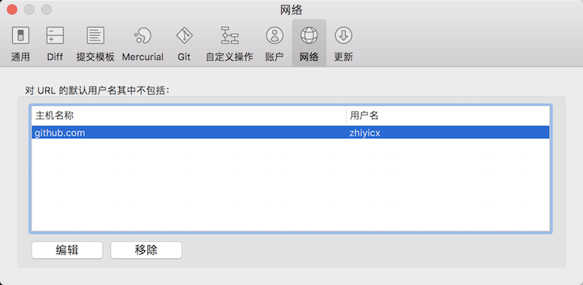

# SourceTree 使用记录


### SourceTree 多账户推送代码

1. 添加多账户，打开 `SourceTree`偏好设置,选中`账户`项添加、编辑即可,如图：

 

2. 切换到当前推送代码的账户，打开 `SourceTree`偏好设置,选中`网络`项，将`用户名`修改为你当前需要推送代码的`用户名`，之后你就可以开开心心的推送代码了。（**注意**：此处修改只针对`SourceTree`有效，命令行推送的账号并没有改变）。

 


### SourceTree 一键多推送多个远端仓库

1. 打开当前项目 git 的`config`文件，文件位于当前项目`.git/config`,如果当前项目中没有发现，那个请打开查看隐藏文件权限。当然也可以通过 SourceTree 打开配置文件，如图：

 

2. 文件内大致如下：

```
[core]
	repositoryformatversion = 0
	filemode = true
	bare = false
	logallrefupdates = true
	ignorecase = true
	precomposeunicode = true
[remote "origin"]
	url = git@github.com:Jungle68/Contacts.git
	fetch = +refs/heads/*:refs/remotes/origin/*
[branch "master"]
	remote = origin
	merge = refs/heads/master

```
此时只需要远端下面增加仓库地址就行，如我在 origin 下增加2个仓库地址：

```
[core]
	repositoryformatversion = 0
	filemode = true
	bare = false
	logallrefupdates = true
	ignorecase = true
	precomposeunicode = true
[remote "origin"]
	url = git@github.com:Jungle68/Contacts.git
	url = git@github.com:Jungle68/test1.git
	url = git@github.com:Jungle68/test1.git
	fetch = +refs/heads/*:refs/remotes/origin/*
[branch "master"]
	remote = origin
	merge = refs/heads/master

```
此时我通过远端 origin 推送即可，三个仓库都可接收到推送；